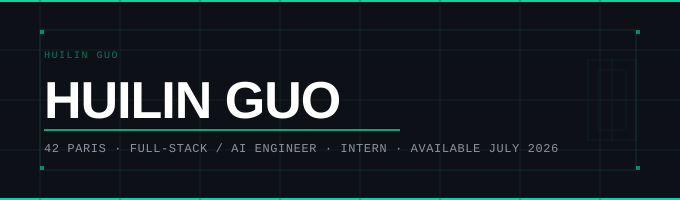

<div align="center">



<br/>

[](http://linkedin.com/in/huilin-guo-782922286)
[](mailto:huilin.guo.contact@gmail.com)


</div>

---

## 👩‍💻 About Me

```python
class HuilinGuo:
    def __init__(self):
        self.location    = "Paris, France 🇫🇷"
        self.school      = "École 42 Paris 🖥️"
        self.goal        = "Full-Stack Intern (Available July 2026) 🚀"
        self.languages   = ["Mandarin", "French", "English", "Spanish"]
```

---

## 🛠 Tech Stack

| Languages | Technologies |
|---|---|
|       |               |
